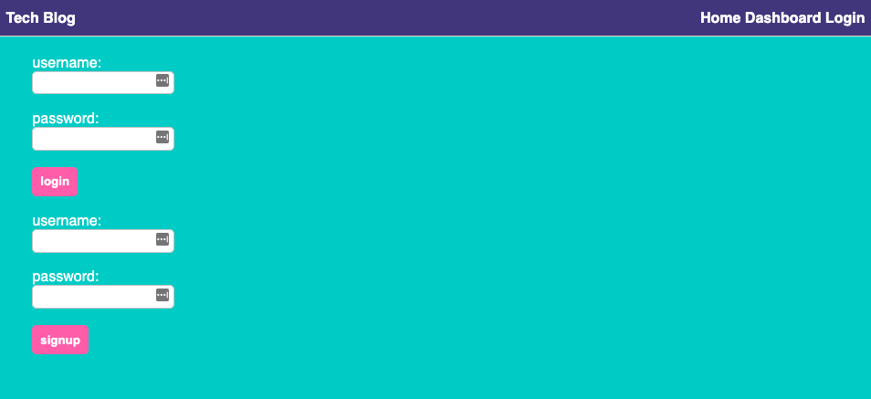
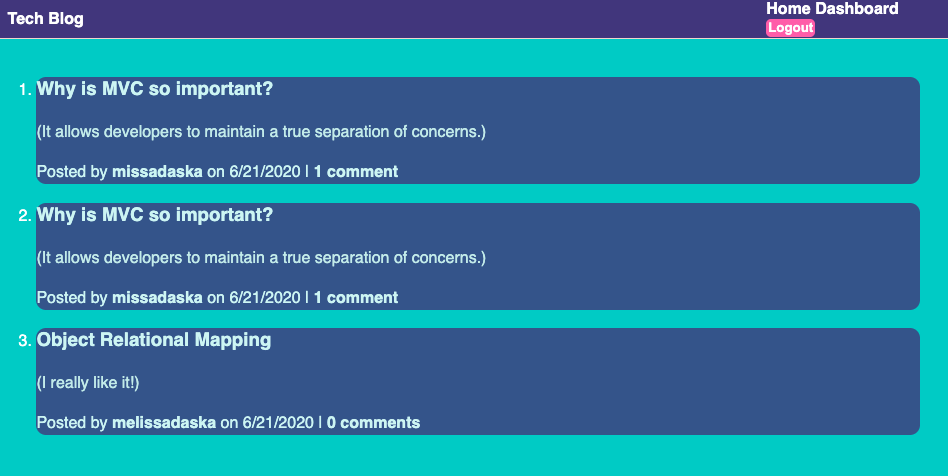
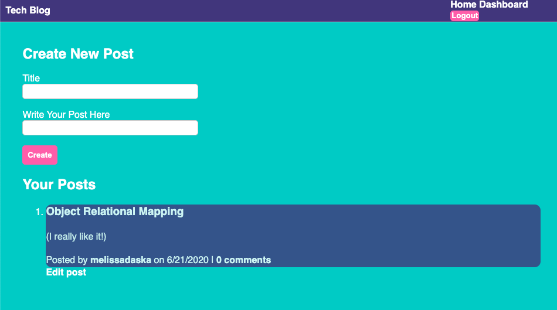
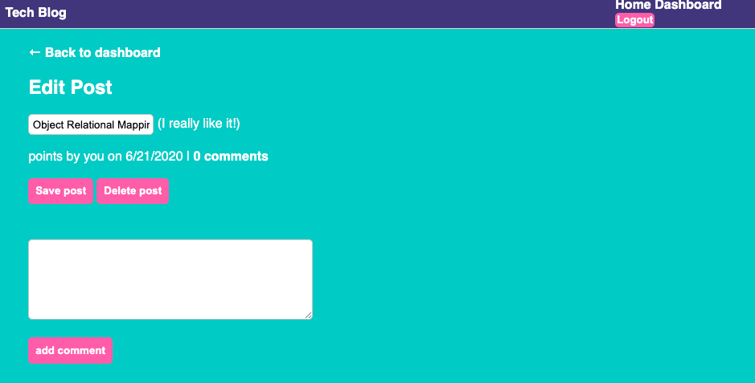

<<<<<<< HEAD
# Budget Tracker
=======
# Tech Blog
>>>>>>> c7f6410911c1e726c940d3dd01f0224b320c2e8c

  ## Table of Contents
  
  * [Description](#description)
<<<<<<< HEAD
  * [Usage](#usage)
  * [Technologies](#technologies)
=======
  * [Screenshots](#screenshots)
>>>>>>> c7f6410911c1e726c940d3dd01f0224b320c2e8c
  * [Questions](#questions)

## Description

<<<<<<< HEAD
This week our challenge was to update an existing budget tracker application to allow for offline access and functionality. This allows the user the ability to add expenses and deposits to their budget with or without a connection. If the user enters a transaction offline, the total should be updated when they're brought back online.

This is very useful for anyone who wants to track their money without an internet or data connection.

Budget Tracker

## Usage
If you would like to download the application, look for the + inside a circle in the address bar of your browser. You will be given the option to download the application if you click on that symbol.

## Technologies
HTML, CSS, JavaScript, MongoDB, Mongoose, IndexedDB (offline persistence), Express, Node.js
=======
This week we built a CMS-style blog site similiar to a Wordpress site where developers can publish their blog posts and comment on other developer's posts as well. It uses handlebars.js as the templating language, Sequelize as the ORM, and express-session npm package for authentication.

This is very useful for a developer who writes about tech and wants a CMS style blog site so that they can publish articles, blog posts, and their thoughts and opinions.

## Screenshots

Sign-up form where you can sign-up or login

Homepage that shows all posts and comments

My Dashboard that shows my posts and option to create a new post

Option to Edit Post (Update or Delete)

>>>>>>> c7f6410911c1e726c940d3dd01f0224b320c2e8c

## Questions
If you have any questions, you can reach me by emailing [melissa.daska@gmail.com](mailto:melissa.daska@gmail.com) or follow the link to my gitHub profile [melissadaska](https://github.com/melissadaska).
